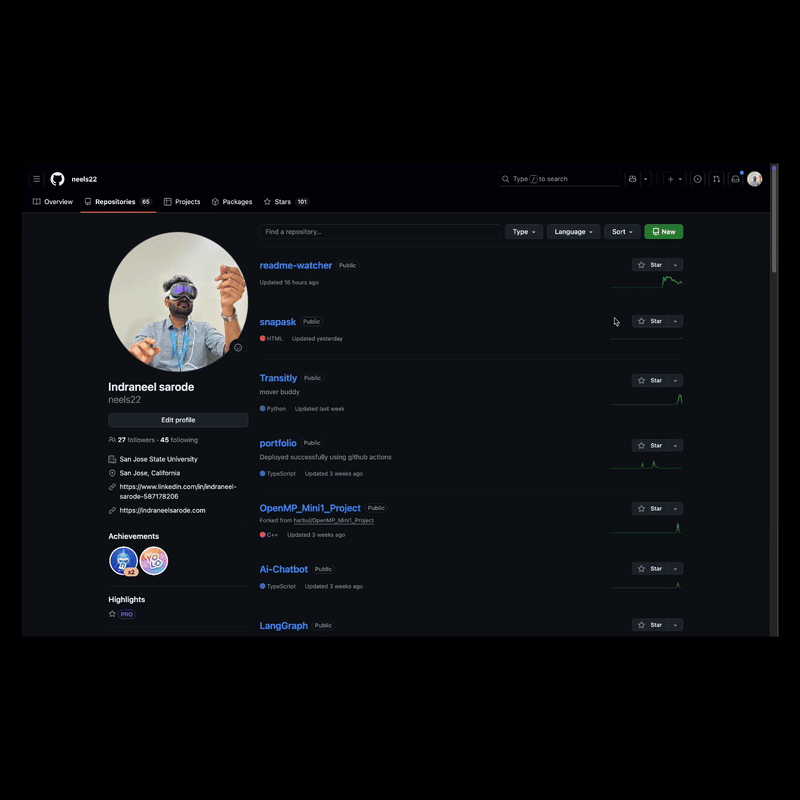

# SnapAsk

An AI-powered screenshot assistant for macOS. Capture any part of your screen with a global shortcut, then ask questions about it using multimodal AI.



## Features

✨ **Global Shortcut** - Press `⌃⌥⌘S` (Control+Option+Command+S) from anywhere  
📸 **Screenshot Capture** - Uses macOS native region selector  
💬 **Floating Chat** - Beautiful chat window appears near your cursor  
🤖 **Google Gemini AI** - Powered by Gemini 1.5 Flash for instant image analysis  
🎨 **Native macOS UI** - Blur effects, smooth animations, dark theme  
💾 **Conversation History** - All conversations saved locally with SQLite  
🔄 **Auto-Updates** - Seamless automatic updates in the background  
📱 **Main App Window** - Full-featured app window to continue conversations  

## Installation

### For End Users

1. Download the DMG file from the [latest release](https://github.com/neels22/snapask/releases) or from the distribution link
2. Open the DMG file
3. Drag `SnapAsk.app` to your Applications folder
4. Open SnapAsk from Applications (you may need to right-click and select "Open" the first time due to macOS security)
5. Follow the onboarding to set up your Gemini API key
6. Grant Screen Recording permission when prompted

**Note:** The app will automatically check for updates and notify you when new versions are available.

### For Developers

## Quick Start

### 1. Install Dependencies

```bash
npm install
```

### 2. Set Up Your Gemini API Key

1. Get your API key from [Google AI Studio](https://makersuite.google.com/app/apikey)
2. Create a `.env` file in the project root:

```bash
GEMINI_API_KEY=your_api_key_here
```

**Note:** The `.env` file is already in `.gitignore` to keep your API key safe.

### 3. Run the App

```bash
npm start
```

### 4. Grant Screen Recording Permission

The first time you take a screenshot, macOS will prompt you to grant Screen Recording permission:

1. Go to **System Settings** → **Privacy & Security** → **Screen Recording**
2. Enable the checkbox for **Electron** (or **SnapAsk** if packaged)
3. Restart the app

### 5. Take Your First Screenshot

1. Press `⌃⌥⌘S` (Control+Option+Command+S)
2. Drag to select a region of your screen
3. A floating chat window appears near your cursor
4. Type your question and press Enter or click "Ask"
5. Gemini AI analyzes your screenshot and responds!

## How It Works

```
User presses hotkey (⌃⌥⌘S)
      ↓
macOS screencapture tool (-i for interactive region select)
      ↓
Screenshot copied to clipboard
      ↓
Electron reads clipboard image
      ↓
Floating window shows near cursor with screenshot preview
      ↓
User asks a question
      ↓
Send image + prompt to Google Gemini AI
      ↓
AI analyzes screenshot and generates response
      ↓
Display response in floating window
```

## Project Structure

```
snapask/
├── main.js           # Electron main process (global shortcut, screenshot capture)
├── preload.js        # IPC bridge (security layer between main & renderer)
├── renderer.html     # Floating chat UI
├── package.json      # Dependencies and scripts
└── README.md         # This file
```

## AI Integration

The app is now **fully integrated with Google Gemini AI**! 🎉

### Current Setup: Google Gemini

- **Model:** Gemini 1.5 Flash (fast responses)
- **Capabilities:** Vision + text understanding
- **Cost:** Pay-per-use (very affordable)

### Switch to a Different AI Provider

Want to use a different AI? Here's how:

### Option 1: OpenAI GPT-4 Vision

1. Get an API key from [platform.openai.com](https://platform.openai.com)
2. Install the OpenAI SDK: `npm install openai`
3. Replace the `mockAICall` function in `renderer.html`:

```javascript
async function callOpenAI(prompt, imageDataUrl) {
  const response = await fetch('https://api.openai.com/v1/chat/completions', {
    method: 'POST',
    headers: {
      'Content-Type': 'application/json',
      'Authorization': `Bearer YOUR_API_KEY`
    },
    body: JSON.stringify({
      model: 'gpt-4-vision-preview',
      messages: [
        {
          role: 'user',
          content: [
            { type: 'text', text: prompt },
            { type: 'image_url', image_url: { url: imageDataUrl } }
          ]
        }
      ],
      max_tokens: 500
    })
  });
  
  const data = await response.json();
  return data.choices[0].message.content;
}
```

### Option 2: Anthropic Claude

```bash
npm install @anthropic-ai/sdk
```

### Option 3: Google Gemini

```bash
npm install @google/generative-ai
```

## Keyboard Shortcuts

| Shortcut | Action |
|----------|--------|
| `⌃⌥⌘S` | Capture screenshot (customizable in `main.js`) |
| `Enter` | Ask question |
| `Esc` | Close floating window |

## Development

### Run with Logging

```bash
npm run dev
```

This enables Electron's logging to help debug issues.

### Changing the Global Shortcut

Edit `main.js` line ~81:

```javascript
globalShortcut.register('Control+Alt+Command+S', takeInteractiveScreenshot);
```

Replace with your preferred combo (e.g., `'CommandOrControl+Shift+X'`).

## Roadmap

- [x] **AI Integration** - Google Gemini API integration ✅
- [x] **Conversation History** - Persistent SQLite storage ✅
- [x] **Full App Window** - "Continue in App" feature ✅
- [x] **Auto-Updates** - Seamless background updates ✅
- [ ] **On-device OCR** - Extract text before sending to save tokens
- [ ] **Menu Bar Icon** - Tray icon with settings
- [ ] **Custom Shortcuts** - User-configurable hotkey
- [ ] **Annotations** - Draw arrows, highlights before asking
- [ ] **Privacy Mode** - Blur sensitive info before upload
- [ ] **Clipboard Mode** - Auto-detect copied images

## Troubleshooting

### "Screenshot not capturing"
- Grant **Screen Recording** permission in System Settings
- Restart the app after granting permission

### "Global shortcut not working"
- Check if another app is using the same shortcut
- Try a different key combination
- Check Console.app for Electron errors

### "Window appears off-screen"
- This can happen on multi-monitor setups
- The app tries to keep windows on-screen; please report if you encounter this

## Branding Assets

- Dock & packaged app icon: `resources/icons/image4.icns`
- BrowserWindow icon (Windows/Linux, ignored on macOS): `resources/icons/image3.png`
- Keep the entire `resources/icons` folder when packaging so runtime helpers can resolve the files.

## Building for Distribution

### Build Commands

```bash
# Build without publishing (for testing)
npm run dist

# Build and publish to GitHub Releases (requires GH_TOKEN)
npm run dist:publish

# Build for macOS only
npm run build:mac
```

### Build Configuration

The app is configured to build for both Intel (x64) and Apple Silicon (arm64) Macs. Builds are automatically published to GitHub Releases for auto-update functionality.

**Requirements for Publishing:**
- GitHub Personal Access Token with `repo` scope
- Set `GH_TOKEN` environment variable
- GitHub repository configured in `package.json`

### Auto-Update System

SnapAsk includes automatic updates that work seamlessly:
- Updates check automatically on startup (after 30 seconds)
- Periodic checks every 4 hours
- Downloads happen in the background
- Users are notified when updates are ready
- Updates install on app quit or can be restarted immediately

The auto-update system uses GitHub Releases as the update server.

## Privacy & Security

- Screenshots are **never saved** to disk (clipboard only)
- Images are sent to your chosen AI provider (not stored elsewhere)
- All processing happens locally until you click "Ask"
- Conversation history is stored **locally only** in SQLite database
- No telemetry or analytics
- No data is sent to third parties except your chosen AI provider

## Changelog

See [CHANGELOG.md](CHANGELOG.md) for version history and release notes.

## License

MIT

## Credits

Built with [Electron](https://www.electronjs.org/)
